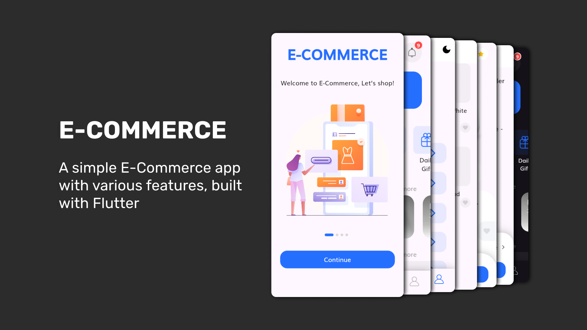
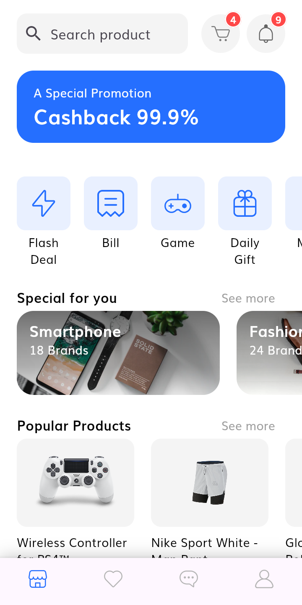
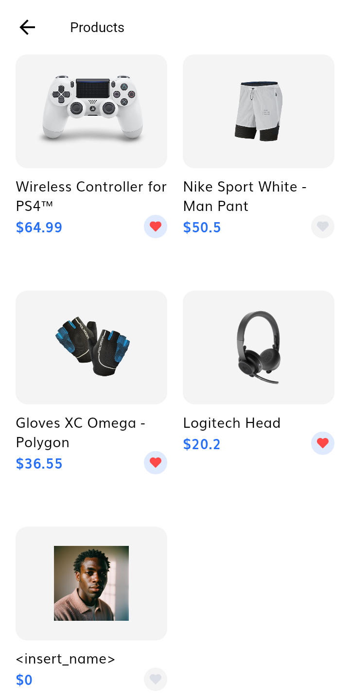
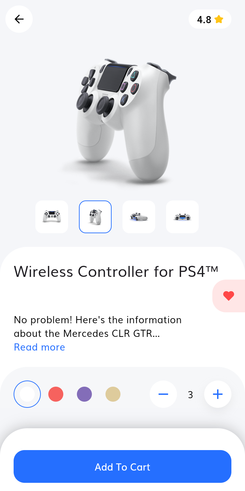
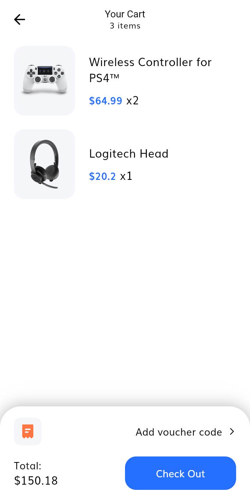
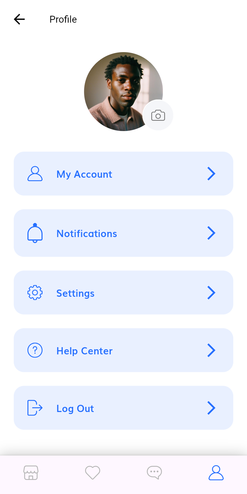

    

        
Home Screen

        
    

    

        
Products Screen

        
    

    

        
Details Screen

        
    

    

        
Cart Screen

        
    

    

        
Profile Screen

        
    

 

Forked (or cloned) from [E-commerce-Complete-Flutter-UI](https://github.com/abuanwar072/E-commerce-Complete-Flutter-UI/tree/cb439a3e6712a6149e532aa077ab2aa48a613933) by [abuanwar072](https://github.com/abuanwar072)